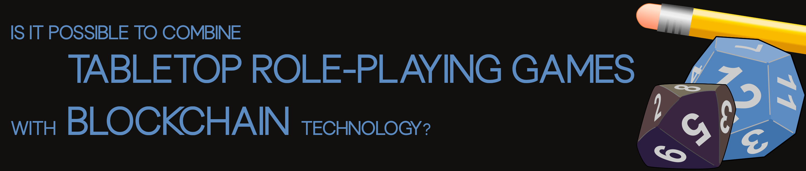

## OpenLore: Crafting a Future for Traditional Tabletop RPG Assets

OpenLore aims to bring new possibilities to traditional tabletop role-playing games by turning their core elements—characters, items, stories, and worlds—into reusable and tradable crypto-assets. Using the Substrate framework, OpenLore hopes to let these virtual assets live beyond their original tabletop sessions, adding to a growing, shared fantasy lore. The project is under development, with plans for open-source, freely available decentralized applications built in Rust and Slint for Windows, Linux, and Mac to create and manage these assets. A separate, commercial web-based marketplace is also planned to support trading, connecting tabletop RPG elements in a digital space.

OpenLore is still taking shape, and its success relies on enthusiastic tabletop RPG players with technical skills joining the effort. Contributions will not only be welcome, but OpenLore is intended to be an open project where decisions are made by the community to help build this vision of preserving and sharing the creativity of traditional tabletop role-playing games. However, this is not yet possible, as the project is still in its early stages. Anyone interested in collaborating can reach out to the development team at info@openlore.network.

Thank you very much.

## Roadmap

### GameMaster

| Component     | Description                                                  | Platform            | Phase  |
|---------------|--------------------------------------------------------------|---------------------|--------|
| Sparks        | Creation of characters and items.                            | OpenLore Builder    | Phase 1 |
| Nexus         | Blockchain node for smart contracts.                         | Service             | Phase 2 |
| Epics         | Creation of game sessions.                                   | OpenLore Builder    | Phase 3 |
| GameMaster    | Management of game sessions.                                 | Standalone app      | Phase 4 |

### Player

| Component     | Description                                                  | Platform            | Phase  |
|---------------|--------------------------------------------------------------|---------------------|--------|
| Player        | Playing online game sessions (as a player).                  | Standalone app      | Phase 5 |
| Viewer        | Playback of game sessions.                                   | Standalone app      | Phase 6 |
| Marketplace   | Buying and selling of crypto-assets.                         | Web                 | Phase 7 |

### Metaverse

| Component     | Description                                                  | Platform            | Phase  |
|---------------|--------------------------------------------------------------|---------------------|--------|
| MapMaker      | Creation of maps, both indoor and outdoor.                   | OpenLore Builder    | Phase 8 |
| SimuRole      | Design of agent-based models for non-player characters.      | OpenLore Builder    | Phase 9 |
